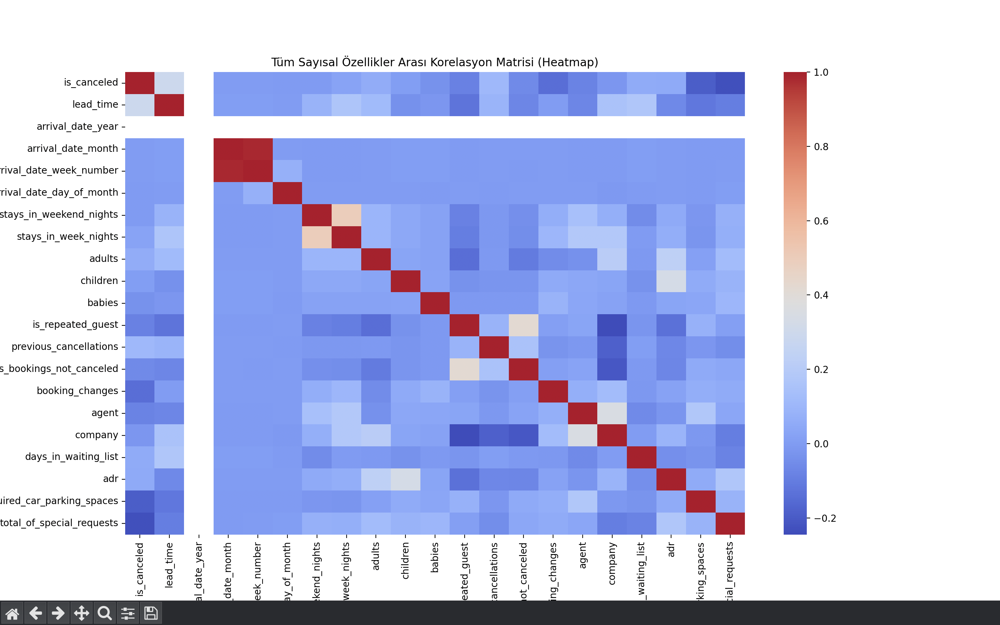
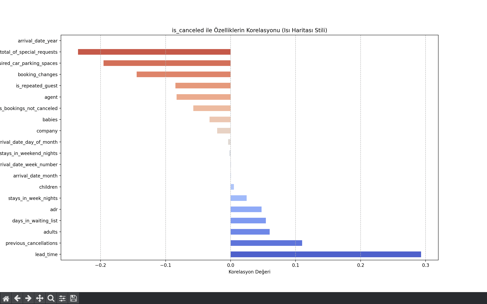
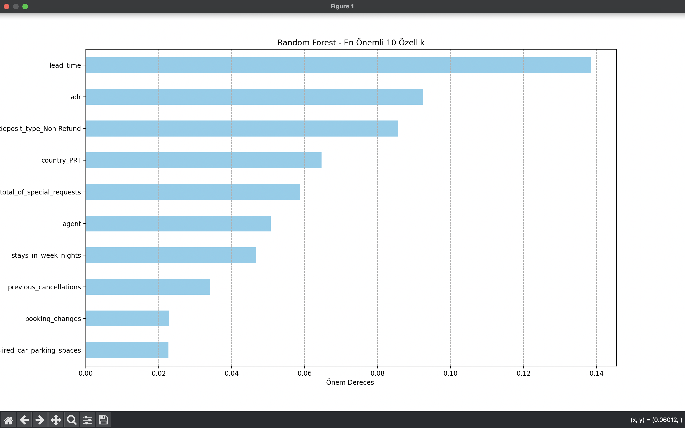

# Otel Rezervasyon İptali Tahmin Modeli
bu proje otel rezervasyon sistemindeki 119,390 adet kayıt ve 32 adet feature kullanarak muşterinin rezervasyonu iptal edip etmeyeceğini tahmin eden bir  ikili sınıflandırma problemidir.

# Veri seti Bilgisi
bu projede Kaggle'dan alınan hotel_bookings_updated_2024 isimli veri seti kullanılmıştır.
 toplam kayıt:119,390
 toplam feature:32
 hedef değişken: is_canceled (0 iptal edilmedi, 1 iptal edildi)


# kütüphaneler
```python
import pandas as pd
import numpy as np
import matplotlib.pyplot as plt
from sklearn.model_selection import train_test_split
from sklearn.metrics import accuracy_score, classification_report
from sklearn.linear_model import LogisticRegression
from sklearn.tree import DecisionTreeClassifier
from sklearn.ensemble import RandomForestClassifier
from sklearn.neighbors import KNeighborsClassifier
from sklearn.svm import SVC
from datetime import datetime
import seaborn as sns
```


# Veri Ön İşleme
## gereksiz sütunların kaldırılması
```python
data=pd.read_csv("hotel_bookings_updated_2024.csv")

silinecekler=["reservation_status","reservation_status_date"]
#bu sütunlar rezervasyon sonrası için değerler verdiğinden tahmini hatalı sonuçlandıracaktır.
data=data.drop(columns=silinecekler)

print(data.head()) #ilk 5 satırı ekrana bastırır
```
reservation_status ve reservation_status_date sütunları tahmini gösteren bilgileri içerdiği için modeli hatalı eğiteceğinden veri setine dahil edilmemiştir.


## Ay bilgisinin numerik hale getirilmesi
```python
data['arrival_date_month']=data['arrival_date_month'].apply(lambda x: datetime.strptime(x,'%B').month)
```
model stringi doğrudan işleyemeyeceği için arrival_date_month'da yer alan kategorik değişkenler numerik hale getirildi. (ocak->1 şubat->2 ...)

##  Diğer sütunların One Hot Encoding ile numerik hale getirilmesi
```python

onehot_cols=[
    "hotel",
    "meal",
    "market_segment",
    "distribution_channel",
    "reserved_room_type",
    "assigned_room_type",
    "deposit_type",
    "customer_type",
    "city",
    "country",
]# one hot encoder ile numerik yapmamız gereken sütunlar

data=pd.get_dummies(data,columns=onehot_cols,drop_first=True) #onehot encoding
print("onehot sonrası kolon sayısı:",len(data))
print(data.head())
```
veri seti incelendiğinde içerisinde ordinal değişken görülmediğinden sadce one hot encoding ile kategorik değişkenler numerik hale getirildi.
(label encoding kullanılmadı çünkü kategoriler arasında bir sıralama oluşmasını istemedik)

## Korelasyon analizi ile gereksiz sütunların çıkartılması
```python
numerical_columns = data.select_dtypes(include=np.number).columns

full_corr_matrix = data[numerical_columns].corr()
plt.figure(figsize=(25, 20))
sns.heatmap(full_corr_matrix, annot=False, fmt=".2f", cmap='coolwarm')
plt.title('Tüm Sayısal Özellikler Arası Korelasyon Matrisi (Heatmap)')
plt.show() # tüm numerik özelliklerin arasındaki korelasyona ait heatmap


corr_matrix = data[numerical_columns].corr()
plt.figure(figsize=(10, 15))
target_corr = corr_matrix['is_canceled'].sort_values(ascending=False).drop('is_canceled')
target_corr.plot(kind='barh', color=sns.color_palette("coolwarm", len(target_corr)))
plt.title('is_canceled ile Özelliklerin Korelasyonu (Isı Haritası Stili)')
plt.xlabel('Korelasyon Değeri')
plt.grid(axis='x', linestyle='--')
plt.show() #sadece is_canceled ve numerik özellikler arası korelasyonun heatmap'i.

for c in data:
    if c!='is_canceled':
         print( f" {c} ile target arası korelasyon:{data['is_canceled'].corr(data[c])}") # tüm numeric sütunlar için is_canceled (target) ile korelasyonuna bak.

gereksiz_sutunlar=[
    'arrival_date_year',
    'arrival_date_month',
    'arrival_date_week_number',
    'arrival_date_day_of_month',
    'stays_in_weekend_nights',
]# korelasyon sonrasında gereksiz görülen sütunlar atılır.
data=data.drop(columns=gereksiz_sutunlar)
```
sayısal özelliklerin arasındaki korelasyona ait heatmap incelendi, daha sonra target ile sayısal özellikler arası heatmap'incelendi ve aynı zamanda bu korelasyon değerleri consola bastırıldı.
korelasyon matrisinde target olan is_cancelled ile ilişkisi düşük olan sütunlar çıkartıldı.
örneğin arrival_date_year sütununda tüm değerler 2024'tür.bu özellik modelin eğitimi için herhangi bir bilgi vermez.

 ## Eksik değerlerin doldurulması
 ```python
data = data.fillna(0)
 ```
 eksik değerleri model işleyemeyeceği için her birinin yerine 0 koyduk.

 ##  Girdi ve Çıktı belirlenmesi & Train test split
  ```python

x=data.drop('is_canceled' ,axis=1)
y=data['is_canceled']

x_train ,x_test, y_train,y_test= train_test_split(x,y,test_size=0.2,random_state=True)
print(data.info())
  ```
Target olarak is_canceled sütunu seçildi, veri seti %80 eğitim %20 test olacak şekilde ayrıldı. consola veri setinin güncel bilgileri bastırıldı.
  
# Kullanılan modeller ve sonuçları
projenin amacı rezervasyon iptal edilecek/edilmeyecek tahmini için ikili sınıflandırma problemidir. sınıflandırma modelleri test edilmiştir.

## 1-) logistic regression

```python
logmodel=LogisticRegression()
logmodel.fit(x_train,y_train)
tahmin=logmodel.predict(x_test)

accuracy=accuracy_score(y_test,tahmin)
print(" logistic regression doğruluk skoru: ",accuracy)
```
logistic regression doğruluk skoru:  0.8004858028310579
bu model target ile diğer özelliklerin arasında doğrusal bir ilişki olduğunu varsayar. Ancak veri seti çok fazla sütun içeriyor ve iptal etme oranı bu sütunların karmaşık ilişkilerinden ortaya çıkıyor.Bu yüzden bu model tüm ilişkileri yakalamakta yetersiz kaldı.

## 2-) DecisionTree
```python
dtmodel=DecisionTreeClassifier()
dtmodel.fit(x_train,y_train)
tahmin=dtmodel.predict(x_test)

accuracy=accuracy_score(y_test,tahmin)

print(" decisition trees doğruluk skoru: ",accuracy)
```
decisition trees doğruluk skoru:  0.8426166345590083
Bu model logistic regressona göre daha iyi sonıç verdi çünkü lineer olmayan ilişkileri de öğrenebilir ancak tek bir karar ağaı yapısı olduğundan overfitting'e yatkın. bu sebeple istenilen verim alınamadı.

## 3-)RandomForest
```python
rfmodel=RandomForestClassifier()
rfmodel.fit(x_train,y_train)
tahminrf=rfmodel.predict(x_test)

accuracyrf=accuracy_score(y_test,tahminrf)
print("random forest doğruluk skoru:",accuracyrf)
```
random forest doğruluk skoru: 0.8730211910545271
aynı adna birden fazla karar ağacı yapısıyla çalışır bu sebeple daha karmaşık ilişkileri yüksek doğrulukta yakalar. overfitting DecisionTree'ye göre daha düşük.Veri seti bu model için ideal.
## 4-)KNN
```python
knnmodel=KNeighborsClassifier()
knnmodel.fit(x_train,y_train)
tahmin=knnmodel.predict(x_test)

accuracy=accuracy_score(y_test,tahmin)
print("KNN doğruluk skoru:",accuracy)
```
KNN doğruluk skoru: 0.78478096993048
test edilen modeller arasında en düşük doğruluk oranı. KNN komşuluk temellidir,one hot encidong sonrasında veri 280 boyutuna geliyor bu da mesafe hesaplamasını KNN için zorlaştırıyor. Ayrıca veri seti boyutu çok fazla.

## 5-)SVC
```python
#bu boyutta bir veri için svc kullanılmaz (veri seti çok büyük).
aşırı yavaş olduğu için kullanmadım.

svcmodel=SVC(random_state=42)
svcmodel.fit(x_train,y_train)
tahmin=svcmodel.predict(x_test)

accuracy=accuracy_score(y_test,tahmin)
print("svc doğruluk skoru:",accuracy)
print("svc doğruluk skoru: skor heaplanamadı çünkü bu yükseklikte bir veri için svc çok yavaş çalışmaktadır.")
```
acc= bilinmiyor
bu kadar büyük bir veri seti boyutu için SVC kullanılamaz(çok uzun sürüyor).

# modeller arasından en yüksek doğruluk değerine sahip model:RandomForest'tır.
```python
print("\n en yüksek doğruluğu veren model: Random Forest modelidir.")
print("Accuracy (train)  %0.1f " % (accuracyrf * 100))
print(classification_report(y_test, tahminrf))
```
# en etkili 10 özellik ekrana tablolaştırılır.
```python
feature_importance = pd.Series(
    rfmodel.feature_importances_,
    index=x_train.columns
).nlargest(10).sort_values(ascending=True)

plt.figure(figsize=(10, 6))
feature_importance.plot(kind='barh', color='skyblue')

plt.title('Random Forest - En Önemli 10 Özellik')
plt.xlabel('Önem Derecesi')
plt.grid(axis='x', linestyle='--')
plt.show()
```
modelin karar verirken en çok hangi değişkenlere dikkat ettiğini anlamak için görselleştirildi.


#  Random Forest Model Çıktısı
```python
 
Accuracy (train)  87.3 
              precision    recall  f1-score   support

           0       0.88      0.93      0.90     15101
           1       0.87      0.77      0.82      8777

    accuracy                           0.87     23878
   macro avg       0.87      0.85      0.86     23878
weighted avg       0.87      0.87      0.87     23878


Process finished with exit code 0
```
çıktı incelendiğinde RandomForest birden fazla karar ağacı içerip  karmaşık ilişkileri yakalayabildiğinden F1 score ve accuricy yüksek çıkmıştır.
iptal edenler  için model iptal etmeyenlere oranda biraz daha iyi çalışmaktadır bunun sebebi de iptal edildi durumu için daha fazla rezervasyon olmasıdır(15101 adet iptal edildi, 8777 adet iptal edilmedi)
ayrca iptal durumu için modelin recall değeri 0.93 bu da modelin gerçek iptalleri kaçırmadığını ancak iptal edilememe durumunda 0.77 oranıyla iptal durumuna göre daha fazla gözden kaçırdığını göstermektedir.

# Tablolar

## sayısal özellikler arası korelasyon heatmap'i


## target ile sayısal özellikler arası korelasyon heatmap'i


## en önemli 10 özellik tablosu



